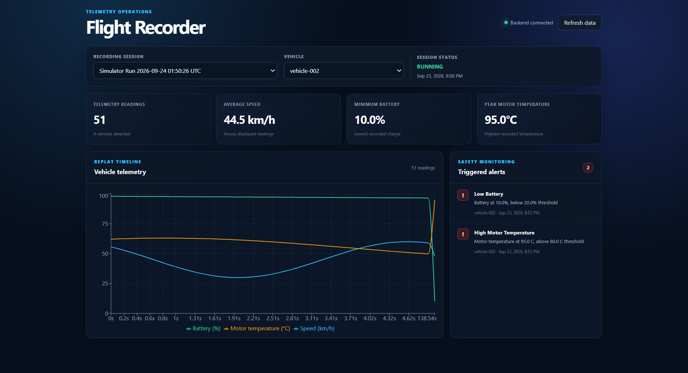
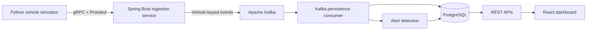

# Flight Recorder

[](https://github.com/IjhadPrasla/flight-recorder/actions/workflows/ci.yml)
[](LICENSE)



A real-time vehicle telemetry ingestion, persistence, replay, and alert-monitoring platform.

Flight Recorder accepts client-streamed telemetry over gRPC, publishes events through Apache Kafka, stores readings in PostgreSQL, detects unsafe operating conditions, and exposes session data through REST APIs to a React dashboard.

## Architecture



## Features

- Client-streaming gRPC telemetry ingestion using Protocol Buffers
- Kafka-based event pipeline with three topic partitions
- Vehicle-keyed events that preserve per-vehicle ordering
- Idempotent PostgreSQL persistence using event IDs and conflict handling
- Automatic vehicle registration during ingestion
- Chronological session replay with optional vehicle filtering
- Low-battery and high-temperature alert detection
- Duplicate-safe alert generation
- Responsive React and TypeScript monitoring dashboard
- Multi-vehicle Python telemetry simulator
- Flyway-managed database schema
- PostgreSQL integration testing with Testcontainers

## Technology Stack

| Area | Technologies |
| --- | --- |
| Backend | Java 21, Spring Boot, Spring MVC, Spring Data JPA |
| Streaming | Apache Kafka, gRPC, Protocol Buffers |
| Database | PostgreSQL, Flyway |
| Frontend | React, TypeScript, Vite, Recharts |
| Simulation | Python, grpcio |
| Testing | JUnit, MockMvc, Testcontainers |
| Infrastructure | Docker Compose, Maven, npm |

## Data Flow

1. The Python simulator creates a recording session through the REST API.
2. Simulated vehicles stream telemetry readings to the gRPC service.
3. The ingestion service validates each reading and publishes its Protobuf payload to Kafka.
4. Kafka partitions events by vehicle ID.
5. A consumer stores readings idempotently in PostgreSQL.
6. Dangerous battery or motor-temperature values generate alerts.
7. The React dashboard retrieves sessions, replay data, and alerts through REST APIs.

## Prerequisites

- Java 21
- Docker Desktop
- Node.js 20.19 or newer
- Python 3.13
- Git

## Running Locally

### 1. Start Kafka and PostgreSQL

From the repository root:

```powershell
docker compose up -d
docker compose ps
```

Both containers should report `healthy`.

### 2. Start the Spring Boot backend

Open another terminal:

```powershell
cd backend
.\mvnw.cmd spring-boot:run
```

The backend starts:

- REST API: `http://localhost:8080`
- gRPC server: `localhost:9090`

Check its health:

```powershell
Invoke-RestMethod http://localhost:8080/actuator/health
```

### 3. Start the React dashboard

Open another terminal:

```powershell
cd frontend
npm install
npm run dev
```

Open `http://localhost:5173`.

### 4. Configure the simulator

From the repository root:

```powershell
python -m venv simulator\.venv

.\simulator\.venv\Scripts\python.exe -m pip install `
    -r simulator\requirements.txt

.\simulator\.venv\Scripts\python.exe -m grpc_tools.protoc `
    -I backend\src\main\proto `
    --python_out=simulator `
    --grpc_python_out=simulator `
    backend\src\main\proto\telemetry.proto
```

Generated Protobuf files and the virtual environment are excluded from Git.

### 5. Generate telemetry

```powershell
.\simulator\.venv\Scripts\python.exe simulator\simulate.py `
    --vehicles 4 `
    --readings 50 `
    --rate 10
```

This produces 200 readings from four simulated vehicles. Refresh the dashboard and select the newly created session.

## REST API

| Method | Endpoint | Description |
| --- | --- | --- |
| `POST` | `/api/sessions` | Create a recording session |
| `GET` | `/api/sessions` | List recording sessions |
| `GET` | `/api/sessions/{id}/telemetry/replay` | Retrieve chronological telemetry |
| `GET` | `/api/sessions/{id}/alerts` | Retrieve triggered alerts |
| `GET` | `/actuator/health` | Check backend health |

Replay supports these query parameters:

- `vehicleId` — optionally filter results by vehicle
- `limit` — limit the returned readings

## Alert Rules

| Alert | Condition |
| --- | --- |
| `LOW_BATTERY` | Battery level below 20% |
| `HIGH_MOTOR_TEMPERATURE` | Motor temperature above 80°C |

Alerts are unique by telemetry event and alert type, preventing duplicate Kafka delivery from producing duplicate database records.

## Testing

Docker must be running because backend integration tests use a PostgreSQL Testcontainer.

### Backend

```powershell
cd backend
.\mvnw.cmd test
```

### Frontend production build

```powershell
cd frontend
npm ci
npm run build
```

## Project Structure

```text
flight-recorder/
├── backend/             Spring Boot, gRPC, Kafka, REST, and persistence
├── frontend/            React and TypeScript monitoring dashboard
├── simulator/           Multi-vehicle Python telemetry generator
├── docker-compose.yml   Kafka and PostgreSQL infrastructure
└── README.md
```

## Engineering Decisions

- **gRPC streaming** provides an efficient, strongly typed ingestion interface.
- **Kafka decouples ingestion from persistence** and supports scalable consumers.
- **Vehicle IDs are Kafka keys** to preserve ordering for each vehicle.
- **Protobuf payloads remain binary in Kafka**, avoiding unnecessary serialization changes.
- **Event IDs and SQL conflict handling** make persistence idempotent.
- **Flyway owns the schema**, while Hibernate validates entity mappings.
- **Testcontainers provides isolated integration databases** during automated tests.

## Future Improvements

- Live dashboard updates using WebSockets or server-sent events
- Authentication and per-user session ownership
- Prometheus metrics and Grafana dashboards
- Distributed tracing across ingestion and persistence
- Cloud deployment with managed Kafka and PostgreSQL
- Configurable alert thresholds

## License

This project is available under the MIT License.